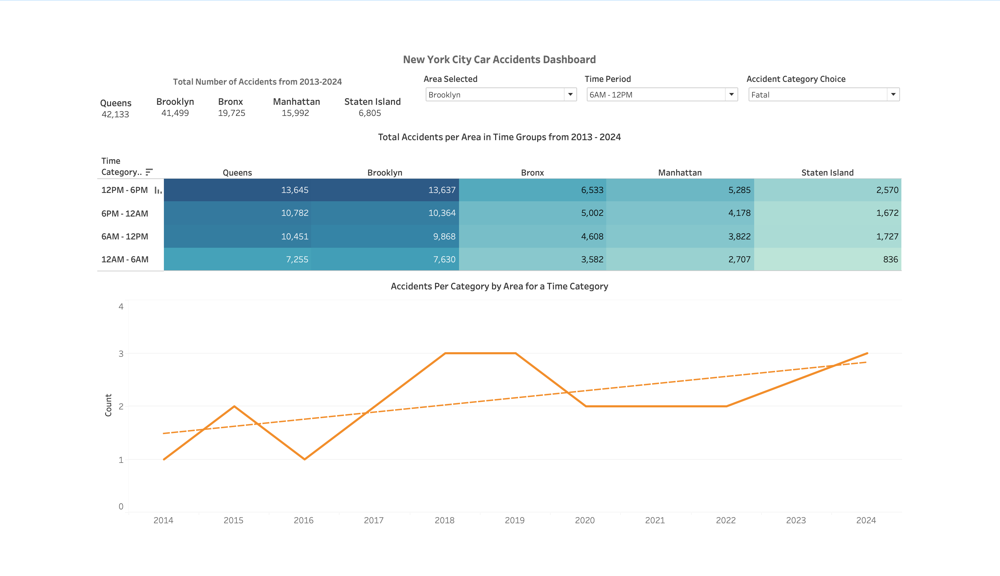

# 🚗 NYC Car Accident Trend Analysis (2012–2025)

## 🧭 Objective

This project analyzes over a decade of motor vehicle accident data across New York City (2012–2025) to provide critical insights for a car company planning to launch a **self-driving car** in the region. The study aims to:

1. Identify **yearly trends** in the number of accidents.
2. Highlight **time periods and boroughs** that are most accident-prone.

---

## 📂 Data Overview

- **Source**: NYC Vehicle Collision Dataset [https://catalog.data.gov/dataset/motor-vehicle-collisions-crashes/resource/b5a431d2-4832-43a6-9334-86b62bdb033f] 
- **Timeframe**: 2012 – 2025  
- **Key Features**: Crash date, time, borough, vehicle type, number of people killed/injured, location information

---

## 🧪 Methodology

### 1. Data Acquisition & Initial Cleaning (Excel)

- Used Excel Power Query to load raw data and dropped columns which were not relevent. 
- Created new columns to to count the number of people killed/injured in the accident. 
- Also created a categorical column to check if the accident was fatal (at least one person is killed), major (involves an injured person) or minor.

### 🔹 SQL
- Extracted the accidents which involved a Sedan or a passenger vehicle, excluding public transport. 
- Crash times were binned into 6-hour intervals:
  - `12AM–6AM`, `6AM–12PM`, `12PM–6PM`, `6PM–12AM`
- Extracted rows which were missing borough while having the latitude and longitude of the accident.
- Excluded the data from 2012 and 2025 as it was not complete and would lead to misinformation. 

### 🔹 Location Processing (Python, Pandas)
- Address-level data was inconsistent for mapping.
- Used **GeoPy** to extract town/borough names from accident locations for spatial analysis.

---

## Dashboard 

## 📊 Key Insights Aligned to Business Goals

### 1. **Trends Over Time**
- **Queens** recorded the **highest number of accidents** involving sedans, followed closely by **Brooklyn**.
- A general **upward trend** in fatal and injury-related accidents was observed in **Queens and Brooklyn**, especially in the `12AM–6AM` time window.
- **Manhattan** demonstrated a **declining trend** in both minor and major accidents, but an **increasing trend in fatal accidents** over the years.

### 2. **Most Accident-Prone Time Periods**
- Across all boroughs, the **12PM–6PM** time window had the **highest volume of reported accidents**, followed by the `6PM–12AM` and `6AM–12PM` intervals.
- The `12AM–6AM` interval shows a **notable rise in major and fatal accidents** in boroughs like **Queens, Brooklyn, and Bronx**.

### 3. **Location-Specific Risk**
- **Brooklyn** reported the **highest number of fatal accidents**, with a noticeable increase during the `6AM–12PM` and `6PM–12AM` windows.
- **The Bronx** mirrored patterns seen in Queens and Brooklyn, particularly showing an **increasing trend of fatal and major accidents in the `12AM–6AM` period**.
- **Staten Island** had the **lowest and most stable count of fatal accidents**, despite following similar trends for minor and major incidents.
- The COVID-19 period (2020–2021) saw a **dip in accident counts**, most evident in Brooklyn, followed by a rebound in the subsequent years.

---

## 🛠 Tools & Technologies

- **Excel Power Query** – Data import and transformation
- **Excel formulas** – Custom aggregations and categorization
- **SQL** - Data Preprocessing
- **GeoPy (Python)** – Borough-level geocoding
- **Tableau** – Trend and comparative visualizations

---

## ✅ Recommendations

Based on the analysis, the following recommendations can be made for the deployment of self-driving vehicles in NYC:

1. **Time-Based Risk Awareness**  
   - The system should be programmed to increase caution levels during **12PM–6PM** and **6PM–12AM**, as data shows most accidents happen in these time windows.
   - Additionally, during late-night to **early morning hours (`12AM–6AM`)**, especially in **Queens, Brooklyn, and Bronx**, accidents tend to be more severe. This information can help the system adapt driving behavior or alert human drivers to be extra careful.

2. **Location-Specific Caution Mechanism**  
   - Since **Manhattan** has shown a drop in accident numbers, the system might apply standard safety protocols there, but still remain alert for serious crashes.
   - In contrast, **Queens and Brooklyn** consistently show high accident rates, so the self-driving system should engage more advanced safety checks and real-time monitoring in these areas.

---
# NYC-Motor-Accident-Analysis
